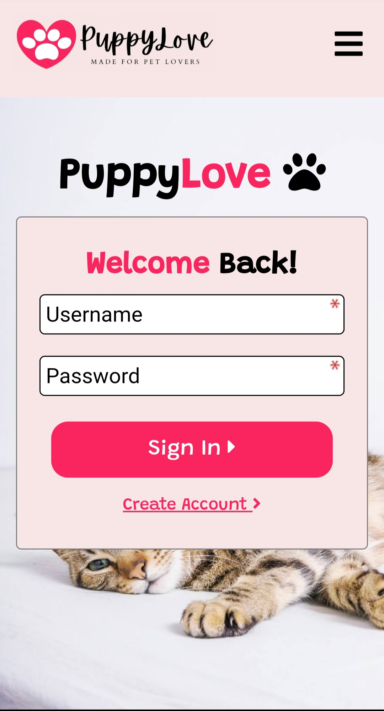

<h1>Puppy Love Dating App</h1>

  
With all of the dating sites geared towards specific interests or lifestyles why hasn't this been thought of sooner? Wanting to give pet lovers a place they can connect with others I created PuppyLove. A dating app geared towards individuals with a deep passion for all things animals!

  
## PERN Stack

PuppyLove was built using the PERN stack as the foundation of the application. The application includes JWT authentication for login and access, a messaging feature using Twilio's Chat API (limited functionality), and image uploads are handled using Cloudinary's API. Designed with a mobile first approach the application includes a Carousel feature to browse users as well as responsive navigation and layouts.

## Features

### Login Authentication

Using JWT, bcrypt, & form data users are able to create profiles, log in & out, and are granted limited access within the applicaiton before being authenticated.

  
  

### Chat & Messaging

Users have the ability to browse and message other users they are interested in talking to. Users are also able to access their active conversations through the messages feature within the application.

  
  

 
### User Profiles

Users are able to create profiles that show off who they are, their interests, and photos of themselves and their pets. Users are also able to create sub-profiles for their animals which are display on the user's profile. Users also have access to a user dashboard that allows them to re-upload their main profile photo and gives a summary of their stored information.

  
  

### Browsing Profiles

Boasting a carousel design users are able to browse through other user profiles while having the ability to view their full profile, pet's sub-profile, and message them.

  
  

### Test it out!

Below are two testable accounts that show off the different features of the application. Chats have already been created between the two accounts to allow real-time testing of the chat feature as well!

Username: testaccount1 / Password: Testing123

Username: testme1 / Password: Testing123

( Please do not delete the test accounts )

## Additional Information

This application was designed and developed as part of a full-stack project that required developing an application using the PERN stack. As my first full-stack project I expanded upon those requirements by including additional features and functionality within the application such as login authentication & use of 3rd party API's (Twilio & Cloudinary). Also worth nothing is that while working with Twilio's Chat API I did run into issues that limited my ability to incorporate a fully functioning chat feature within the application. While is does allow user's connected into the same chat room to real-time communicate and send messages to other users there is limited functionality as of this writing related to receiving messages and retrieving conversations.
  

